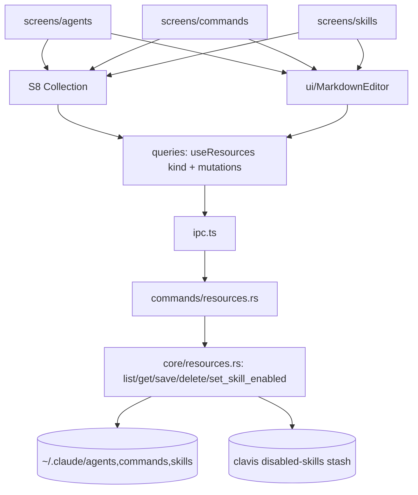

# Design Document — agents-commands-skills (S9)

## Overview

A shared Rust markdown‑resource module (`core/resources.rs`) lists/reads/writes the three resource families — agents, commands, skills — parsing YAML frontmatter + body, with a safe skill enable/disable (folder ↔ Clavis stash). Three frontend screens (`agents`, `commands`, `skills`) each build a `CollectionConfig` over the S8 generic `Collection` (reused unchanged) and share one `MarkdownEditor` (CodeMirror 6) for add/edit. The Skills enabled count feeds the status bar. All writes atomic.

## Steering Document Alignment

### Technical Standards (tech.md)
- CodeMirror 6 via `@uiw/react-codemirror` + `@codemirror/lang-markdown` for the editor. Reuses S3 `atomic_fs`/`paths`; S8 `Collection`. TanStack Query hooks. No credential access.

### Project Structure (structure.md)
- `src-tauri/src/core/resources.rs` + `commands/resources.rs` + `model.rs`. Frontend: `src/ui/MarkdownEditor.tsx` (shared modal editor), `src/screens/agents/`, `src/screens/commands/`, `src/screens/skills/`, hooks in `queries.ts`.

## Code Reuse Analysis

### Existing Components to Leverage
- **S3** `paths::{agents_dir,commands_dir,skills_dir}`, `atomic_fs`. **S8** `Collection` + `CollectionConfig` (consumed by all three). **S1** `@/ui` Modal, Button, Input, Badge.
- A small frontmatter splitter in Rust (`---\n … \n---\n body`), tolerant of missing/invalid frontmatter (whole file = body).

### Integration Points
- `~/.claude/{agents,commands,skills}` ↔ `core/resources` ↔ commands ↔ `useResources(kind)` ↔ the three screens via `Collection`. The skill stash dir under the Clavis config dir. Skills count → status bar.

## Architecture

### Modular Design Principles
- One `core/resources` parameterized by a `kind` (Agent/Command/Skill) instead of three modules. The `Collection` stays generic; each screen only supplies a config + the editor wiring. `MarkdownEditor` is shared.

## Components and Interfaces

### core/resources.rs
- `kind`: `Agent | Command | Skill`. `list(kind) -> Vec<Resource>` (read the dir; for skills, also list the stash as disabled). `get(kind, name) -> ResourceDetail` (raw `.md` + parsed meta). `save(kind, name, raw)` (atomic write to the right path; skills → `skills/<name>/SKILL.md`). `delete(kind, name)` (file; skill → remove folder). `set_skill_enabled(name, on)` (move folder `~/.claude/skills/<name>` ↔ stash). Frontmatter parse: split on `---` fences; tolerate absence.

### model.rs (extend)
- `Resource { kind, name, description, body_lines, model?, source?, enabled?, path, args_hint?, tools? }` and `ResourceDetail { ...Resource, raw }`. Strings/numbers only.

### commands/resources.rs
- `list_resources(kind)`, `get_resource(kind, name)`, `save_resource(kind, name, raw)`, `delete_resource(kind, name)`, `set_skill_enabled(name, on)` → `Result<_, CoreError>`; registered in `lib.rs`.

### src/ui/MarkdownEditor.tsx
- A Modal hosting `@uiw/react-codemirror` with `markdown()` extension + the Clavis dark/light theme; props: `title`, `value`, `onSave`, `onCancel`; full‑height mono editor; Save/Cancel.

### screens/{agents,commands,skills}/index.tsx
- Each builds a `CollectionConfig<Resource>`: Agents (model Badge tag, line meta, no toggle, detail Model/Tools/Path + body preview); Commands (leading `/`, no tag/toggle, line meta, detail Argument‑hint/Path + body preview); Skills (source Badge tag, toggle via `set_skill_enabled`, detail Source/Path/Status + body preview). "Add X" + row/detail edit open `MarkdownEditor`; delete confirms.

### queries.ts
- `useResources(kind)` + `useSaveResource/useDeleteResource/useSkillEnabled`; Skills hook hydrates `skillsEnabledCount` into the store for the status bar. Off‑Tauri demo sets.

## Data Models
(See `Resource`/`ResourceDetail`.) Agents/commands are single `.md`; skills are `~/.claude/skills/<name>/SKILL.md`; disabled skills live in `<clavis-config>/disabled-skills/<name>/`. Counts derive from enabled skills.

## Error Handling
1. **Missing dir:** empty list.
2. **Malformed frontmatter:** treat whole file as body; still listable/editable.
3. **Save/delete fail:** atomic write means no partial file; toast `CoreError`.
4. **Skill toggle:** folder move is atomic+reversible; mid‑crash leaves the folder in exactly one place.
5. **Duplicate/invalid name on add:** validation blocks.
6. **Off‑Tauri:** demo sets.

## Testing Strategy

### Backend (Rust, temp fixture)
- `list(Agent)` parses frontmatter (name/description/model) + line count; `list(Command)` (argument‑hint); `list(Skill)` derives source + enabled; `save` writes to the right path atomically; `delete` removes; `set_skill_enabled(false)` moves to stash (files preserved) + `(true)` restores; malformed frontmatter → body only; missing dir → empty.

### Frontend (Vitest + Testing Library, IPC mocked)
- Each screen lists from a mocked `useResources`; the right badges/columns render; Add/edit opens `MarkdownEditor` and Save calls `saveResource`; Skills toggle calls `set_skill_enabled`; delete confirms+calls `deleteResource`. `MarkdownEditor` renders the value and Save returns the edited text.

### Manual (desktop)
- The three screens show this machine's **real** agents (code‑reviewer, planner, …), commands, and skills; editing one and saving round‑trips the `.md`; toggling a skill off moves its folder to the stash and the status‑bar Skills count drops, restored on re‑enable.
