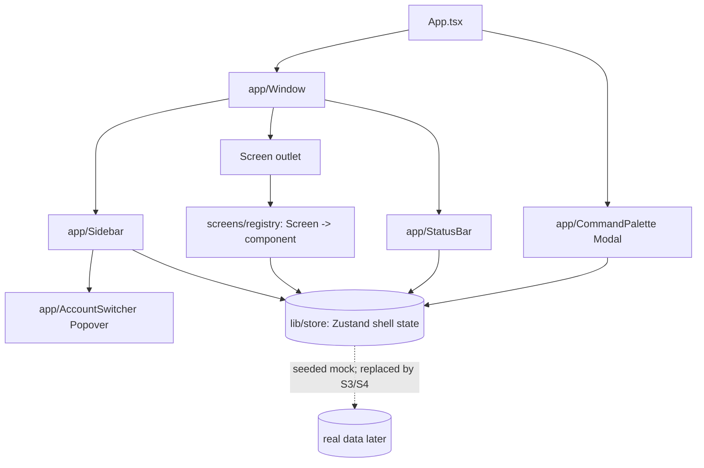

# Design Document — app-shell-navigation (S2)

## Overview

S2 assembles the Clavis shell from the S1 library: a frameless Tauri window with functional macOS‑style traffic‑light controls, the 248px sidebar (logo, ⌘K launcher, three nav groups, active‑config switcher, theme switch), the status bar, a typed router that mounts all 13 screens as placeholders, the ⌘K command palette with real arrow‑key navigation, and global shortcuts. Shell state (active screen, active config, nav/toggle counts) is held in a single Zustand store seeded with mock data, structured so S3/S4 swap the mock for real Rust‑backed data without touching shell components.

## Steering Document Alignment

### Technical Standards (tech.md)
- Frameless window via `tauri.conf.json` (`decorations:false`, `transparent` as needed); window controls through `@tauri-apps/api/window` (`getCurrentWindow().minimize()/toggleMaximize()/close()/startDragging()`), gated by narrow `core:window` + `core:webview` capabilities.
- Zustand for ephemeral UI/shell state (per tech.md split: Zustand = UI, Query = data later). Components use S1 tokens/components only.

### Project Structure (structure.md)
- Shell in `src/app/` (`Window.tsx`, `Sidebar.tsx`, `StatusBar.tsx`, `CommandPalette.tsx`, `AccountSwitcher.tsx`, `router.ts`); screens in `src/screens/<screen>/`; a `screens/registry.ts` maps `Screen` → component; `src/lib/store.ts` holds the shell store.

## Code Reuse Analysis

### Existing Components to Leverage
- **S1 `@/ui/*`**: `Button`, `IconButton` (traffic lights, window controls), `SegmentedControl` (theme switch), `Badge` (tier/provider/active), `Popover` (switcher), `Modal` (palette host), `Input` (palette search), `icons`, `LogoMark`/`LogoTile`.
- **S1 `@/theme`**: `useTheme()` for the theme switch + palette theme entry; tokens for all styling.
- **S1 `@/lib/prefs` + `cn`**: persistence + class merge.

### Integration Points
- **Tauri window API**: window controls + drag. **S1 store (`tauri-plugin-store`)**: theme persistence (already wired). **Mock shell state**: a typed seed mirroring the real shapes (accounts, providers, mcp/skills counts) so S4 can replace the source.

## Architecture



### Modular Design Principles
- **Single File Responsibility**: each shell piece in its own file; the router/registry is data, not logic.
- **Component Isolation**: palette and switcher are independent overlays driven by store state.
- **Service Layer Separation**: all shell state + actions live in `lib/store.ts`; components read/dispatch, never hold cross‑cutting state.

## Components and Interfaces

### app/Window.tsx
- **Purpose:** frameless frame: drag region + traffic lights, `[sidebar][main]` + status bar, warm bg, rounded only where the OS shows the window edge.
- **Interfaces:** renders `Sidebar`, the active screen via registry, `StatusBar`; hosts the `CommandPalette`.
- **Dependencies:** Tauri window API (`startDragging`, `minimize`, `toggleMaximize`, `close`), `IconButton`.

### app/Sidebar.tsx
- **Purpose:** logo + version pill, ⌘K launcher button, three nav groups, active‑config card, theme switch + version.
- **Interfaces:** reads `activeScreen`, `activeConfig`, nav groups; dispatches `go(screen)`, `openPalette()`, `toggleSwitcher()`.
- **Reuses:** `LogoTile`, `Badge`, `SegmentedControl`, `icons`, `AccountSwitcher`.

### app/AccountSwitcher.tsx
- **Purpose:** the switcher Popover (Claude accounts + API providers + Sign in).
- **Interfaces:** `switchTo(id)`, `openOauth()` (stubbed to a toast in S2; real in S4); reads accounts/providers from the store.

### app/StatusBar.tsx
- **Purpose:** active name, model, MCP/Skills counts, tokens‑today, Synced — all from the store (mono).

### app/CommandPalette.tsx
- **Purpose:** ⌘K palette with grouped actions + real keyboard nav.
- **Interfaces:** builds actions from nav destinations + accounts + theme; `query` filter; `selectedIndex` with ↑/↓/Enter/Esc; performs the action and closes.
- **Reuses:** `Modal`, `Input`, `icons`.

### app/router.ts + screens/registry.ts
- **Purpose:** `Screen` union + ordered nav metadata (group, label, icon) + `registry: Record<Screen, ComponentType>`; helpers `isScreen`, `defaultScreen='overview'`.

### screens/[screen]/index.tsx (×13)
- **Purpose:** placeholder per screen = `ScreenHeader` (title + one‑liner, the shared sticky‑header pattern) + a labelled empty body. `ScreenHeader` is a small shared shell component reused by every real screen later.

### lib/store.ts (Zustand)
- **Purpose:** `{ activeScreen, paletteOpen, switcherOpen, activeConfigId, accounts[], providers[], mcpEnabledCount, skillsEnabledCount, tokensToday, model }` + actions `go`, `openPalette/closePalette/togglePalette`, `toggleSwitcher`, `switchTo`. Seeded with mock data shaped like the real domain types so S4 swaps the source.

## Data Models

### Screen (union) + NavItem
```
Screen = 'overview'|'configs'|'editor'|'projects'|'mcp'|'agents'|'commands'|'skills'|'memory'|'usage'|'notifications'|'experimental'|'settings'
NavItem: { screen: Screen, label: string, icon: IconName, group: 'main'|'customize'|'system' }   // 'editor' not in nav
```

### ShellConfig (mock now, real in S4)
```
Account:  { id, name, org, email, tier: 'Max 5×'|'Max 20×'|…, avatarSeed }
Provider: { id, title, brand: 'anthropic'|'zai'|'kimi'|'aws'|'deepseek', baseUrl, model }
activeConfig = account | provider (by activeConfigId)
```

## Error Handling

### Error Scenarios
1. **Window control unavailable (web/dev preview):** wrap Tauri window calls in a guard that no‑ops + toasts in a plain browser, so `vite dev`/gallery still work.
2. **Unknown activeScreen:** registry lookup falls back to `overview`.
3. **Palette over empty filter:** show a "No results" row; Enter with no selection is a no‑op.
4. **Focus management:** palette/switcher trap focus and restore it to the trigger on close; key handlers are removed on unmount.

## Testing Strategy

### Unit Testing (Vitest + Testing Library)
- `router`/registry: every `Screen` resolves to a component; `isScreen` guards; default fallback.
- `CommandPalette`: filter narrows items; ↑/↓ moves selection; Enter fires the action; Esc closes.
- `store`: `go` sets activeScreen; `switchTo` updates active config + derived status values.
- `Sidebar`: active item styling reflects `activeScreen`; Config Editor keeps Configurations active.

### Integration Testing
- Shell renders; clicking a nav item swaps the screen; opening the switcher and choosing an account updates the sidebar card + status bar; ⌘K opens the palette and "Go to Usage" navigates.

### Visual / E2E
- `vite dev` shell screenshot (light + dark) cross‑checked against `.design-bundles/Clavis.dc.html` shell (sidebar, nav groups, active state, status bar, palette) — the first real design‑parity check on app chrome.
