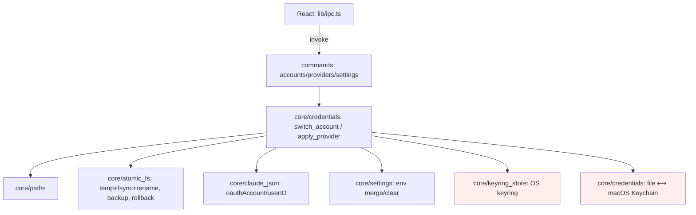

# Design Document — claude-data-core (S3)

## Overview

S3 implements the privileged Rust core under `src-tauri/src/core/` plus thin command wrappers and a typed TS IPC layer. It centralizes path resolution, atomic file I/O (temp+fsync+rename, 0600, rotating backups, rollback), per‑OS credential access (file on Linux/Windows, Keychain on macOS), an OS‑keyring account vault, JSON editors that preserve unknown keys, and the two switch algorithms. The frontend receives only labels/metadata. The safety‑critical logic is exhaustively unit‑tested against a temp `CLAUDE_CONFIG_DIR` fixture. No UI screen ships here; S4 consumes the commands.

## Steering Document Alignment

### Technical Standards (tech.md)
- Adds Rust deps: `keyring = "3"` (Linux backend dbus‑secret‑service, `vendored`), `serde`/`serde_json` (preserve_order), `dirs`, `tempfile` (tests), `thiserror`. All token I/O in Rust; capabilities stay narrow.
- Implements the algorithm + gotchas G1–G12 from `research/modern-impl.md`.

### Project Structure (structure.md)
- `src-tauri/src/core/{paths,atomic_fs,credentials,keyring_store,claude_json,settings}.rs`, `src-tauri/src/commands/{accounts,providers,settings}.rs`, `src-tauri/src/model.rs`; frontend `src/lib/ipc.ts` + extended `src/lib/types.ts`. Dependency direction `commands → core → model`.

## Code Reuse Analysis

### Existing Components to Leverage
- **S2 `tauri-plugin-store`** for non‑secret account metadata; **S2 `useShellStore`** shapes (Account/Provider) — `model.rs` mirrors them so the store can later source from IPC.
- **S2 `src/lib/types.ts`** extended with the IPC DTOs; **research `modern-impl.md`** as the authoritative algorithm/path/gotcha reference.

### Integration Points
- **OS keyring** (secrets), **tauri-plugin-store** (metadata), **the real `~/.claude*` files** (read/write). The Tauri builder registers the new commands.

## Architecture



### Modular Design Principles
- **Single File Responsibility**: each `core/*` module owns one concern; `credentials.rs` hides the file‑vs‑Keychain split behind one trait/impl chosen at runtime by OS.
- **Service Layer Separation**: commands validate + adapt; core does the work; model holds shared types.
- **Utility Modularity**: `atomic_fs` is a generic primitive reused by every writer.

## Components and Interfaces

### core/paths.rs
- **Purpose:** resolve Claude paths per OS honoring `CLAUDE_CONFIG_DIR`.
- **Interface (Rust):** `claude_dir() -> PathBuf`, `credentials_path()`, `settings_path()`, `dot_claude_json()` (at `$HOME`), `projects_dir()`, `agents_dir()`, `commands_dir()`, `skills_dir()`, `claude_md()`, `backups_dir()`, `detect_env_overrides() -> EnvOverrides`.

### core/atomic_fs.rs
- **Purpose:** the safe write primitive + backup/rollback.
- **Interface:** `atomic_write(path, bytes, mode: Option<u32>)` (temp in same dir → fsync → rename → chmod); `backup(path) -> Option<BackupHandle>` (timestamped, rotate keep‑N); `restore(BackupHandle)`; `read_json_value(path)`; `write_json_preserving(path, mutate: FnOnce(&mut Value))` (serde_json with preserve_order; mutate only targeted keys).

### core/credentials.rs
- **Purpose:** read/write the active subscription credential per OS, preserving `mcpOAuth`.
- **Interface:** `read_active() -> ActiveCredential` (blob + non‑secret descriptor); `write_active(claude_ai_oauth: Value)` — Linux/Win: merge into `.credentials.json` keeping `mcpOAuth`, atomic 0600; macOS: set Keychain item `Claude Code-credentials`/`$USER`. Backed by a small `CredentialBackend` trait with `FileBackend` and `KeychainBackend` (via `keyring`/`security-framework`).

### core/keyring_store.rs
- **Purpose:** Clavis's own account vault.
- **Interface:** `vault_put(id, blob)`, `vault_get(id) -> Value`, `vault_delete(id)`, `vault_has(id)` — keyring service `app.clavis.accounts`. Secrets never returned to commands beyond what a switch needs internally.

### core/claude_json.rs + core/settings.rs
- **Purpose:** edit `~/.claude.json` (read/write `oauthAccount`+`userID`, read `mcpServers`/`projects` later) and `settings.json` (`merge_env`, `clear_env`) — both via `write_json_preserving` (unknown keys kept).

### commands/* + model.rs
- **Purpose:** the typed boundary. `model.rs`: `AccountMeta{id,label,email,tier,lastUsed}`, `ProviderMeta`, `ActiveIdentity{kind,label,email,tier,model,expiresAt}`, `SwitchResult{identity,applyNote}`, `EnvOverrides`, `CoreError` (thiserror → serializable). Commands: `list_accounts`, `get_active_identity`, `add_account_from_active`, `switch_account(id)`, `remove_account(id)`, `list_providers`, `apply_provider(meta+secret)`, `clear_provider`, `read_settings_summary`, `detect_env_overrides`. **No token field on any return type.**

### src/lib/ipc.ts + types.ts
- **Purpose:** typed `invoke` wrappers + DTOs mirroring `model.rs`; the single place screens call the backend.

## Data Models

```
// .credentials.json (only claudeAiOauth is swapped; mcpOAuth preserved)
claudeAiOauth: { accessToken, refreshToken, expiresAt, scopes[], subscriptionType, rateLimitTier }   // secret blob
// vault entry (OS keyring, service app.clavis.accounts, key=id): the claudeAiOauth blob (+ captured oauthAccount)
// store metadata (tauri-plugin-store): AccountMeta[] (no tokens) + ordering + lastUsed
ActiveIdentity (to UI): { kind:'account'|'provider', label, email?, tier?, model?, expiresAt? }   // NO tokens
SwitchResult: { identity: ActiveIdentity, applyNote: string }
```

## Error Handling

### Error Scenarios
1. **Target not in vault:** `switch_account` returns `CoreError::AccountNotFound` and makes no changes (Req 5.2).
2. **Write fails mid‑switch:** restore both files from backups (`restore`), return `CoreError::SwitchFailedRolledBack` (Req 5.4).
3. **`CLAUDE_CODE_OAUTH_TOKEN` set:** `switch_account` proceeds but `SwitchResult.applyNote`/a warning flags the override; `detect_env_overrides` surfaces it (Req 1.3, 5.1).
4. **macOS Keychain ACL/locked:** surface a clear error suggesting unlock; never silently no‑op.
5. **Corrupt JSON input:** parse error → `CoreError::CorruptFile{path}`; no write attempted.
6. **Only‑credential safety:** capture→vault→backup always precede any overwrite (Req 4.4, 5.1).

## Testing Strategy

### Unit/Integration Testing (Rust, temp fixture)
A `TestEnv` sets `CLAUDE_CONFIG_DIR` to a `tempfile::TempDir` and seeds `.credentials.json` (with `claudeAiOauth` + `mcpOAuth`), `.claude.json` (`oauthAccount`+`userID`), `settings.json`. Cases:
- `atomic_write` produces the file at mode 0600 and never leaves a temp on success/failure.
- `backup` + `restore` round‑trip; rotation keeps ≤ N.
- `write_json_preserving` keeps unknown keys + key order.
- credential swap replaces `claudeAiOauth` and **preserves `mcpOAuth`** + other keys.
- `switch_account` happy path: active becomes target; previous captured to vault; identity returned has no token.
- `switch_account` failure injection → both files rolled back to pre‑switch bytes.
- vault add/list/get/remove; `list_accounts` returns metadata only (assert no token substring).
- `apply_provider` merges only `env`; `clear_provider` removes only `env`; both preserve other settings keys.
- `detect_env_overrides` flags `CLAUDE_CODE_OAUTH_TOKEN`.
(Keychain path is abstracted behind `CredentialBackend`; tests exercise `FileBackend`. macOS Keychain is covered by a thin integration test gated to `target_os=macos`.)

### Frontend
- `src/lib/ipc.ts` type‑checks against `model.rs` DTOs; a light test asserts the wrappers call `invoke` with the right command names (Tauri mocked). No tokens appear in any TS type.

### Manual (later, S4)
- Real switch on this Linux box is exercised when S4 wires the UI; S3 ships with the command surface + tests proving safety.
