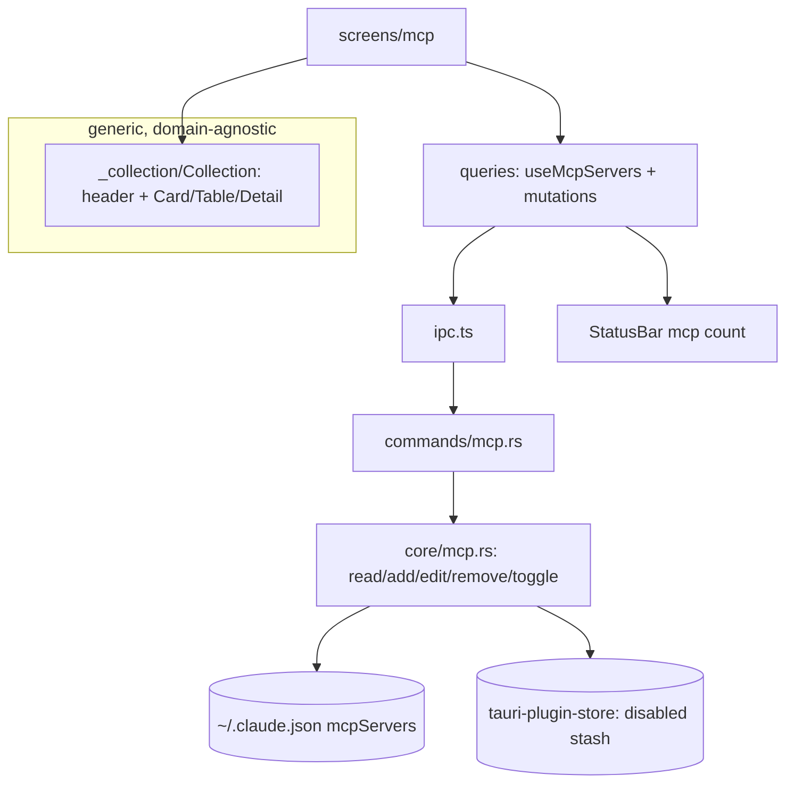

# Design Document — collection-and-mcp (S8)

## Overview

Two parts. **Frontend:** a generic, reusable `Collection` component (header with search + view‑mode toggle + "Add X"; Card / Table / Master‑detail bodies) that MCP/Agents/Commands/Skills all consume via a per‑collection config — no domain logic inside it. **Backend + MCP screen:** `core/mcp.rs` reads/normalizes global MCP servers from `~/.claude.json` `mcpServers`, supports add/edit/remove (atomic, preserve keys) and a safe enable/disable toggle backed by a Clavis‑managed disabled stash, exposed via commands; the MCP screen renders them through the collection and feeds the enabled count to the status bar.

## Steering Document Alignment

### Technical Standards (tech.md)
- Reuses S3 `atomic_fs` + `claude_json` for safe `~/.claude.json` writes; disabled stash in `tauri-plugin-store` (non‑secret). TanStack Query hooks; the collection is presentation‑only. No credential files touched; `mcpOAuth` untouched.

### Project Structure (structure.md)
- `src-tauri/src/core/mcp.rs` + `commands/mcp.rs` + `model.rs` (McpServer DTOs). Frontend: `src/screens/_collection/Collection.tsx` (+ `CardView`/`TableView`/`DetailView`), `src/screens/mcp/` (screen + `McpServerForm`), `useMcpServers`/mutations in `queries.ts`.

## Code Reuse Analysis

### Existing Components to Leverage
- **S3** `claude_json` (read/write `~/.claude.json` preserving keys), `atomic_fs`. **S1** `@/ui` Card, Switch, Badge, Input, Select, Button, IconButton, SegmentedControl, Modal, Popover. **S7/S4** queries/ipc patterns + `selectStatus` for the count.

### Integration Points
- `~/.claude.json` `mcpServers` ↔ `core/mcp` ↔ commands ↔ `useMcpServers` ↔ MCP screen via the `Collection`. The disabled stash (store) holds toggled‑off definitions. Enabled count → store `mcpEnabledCount` → status bar.

## Architecture

### Modular Design Principles
- `Collection` is generic over an item type with a render config (columns, tag, toggle?, detail preview); MCP supplies the config. S9 reuses `Collection` unchanged.
- `core/mcp` is the only writer of `~/.claude.json` `mcpServers`; toggle never deletes a definition (stash round‑trip).

## Components and Interfaces

### core/mcp.rs
- `list() -> Vec<McpServer>` (global enabled from `~/.claude.json` + disabled from the stash, each normalized). `upsert(McpServerInput)` (write into `mcpServers`, preserve keys). `remove(name)`. `set_enabled(name, on)` — move the definition between `~/.claude.json` `mcpServers` and the stash atomically. `enabled_count()`. Stash persisted as a Clavis file/store value.

### model.rs (extend)
- `McpServer ( name, transport: "stdio"|"http"|"sse", command?, args?, env?, url?, scope: "user"|"project", enabled, tools_hint? )` and `McpServerInput`. Non‑secret in transit except the `env` the user explicitly edits (kept in the edit form only).

### commands/mcp.rs
- `list_mcp_servers`, `save_mcp_server(input)`, `delete_mcp_server(name)`, `set_mcp_enabled(name, on)` → all `Result<_, CoreError>`; registered in `lib.rs`.

### screens/_collection/Collection.tsx
- Props: `items`, `view`/`onView`, `query`/`onQuery`, `addLabel`/`onAdd`, and a `config` ( icon(item), name(item), description(item), tag(item)?, meta(item)?, toggle?(item)→(on,onToggle), columns, detail(item)→(props, preview) ). Renders header + the selected view. Generic, no MCP knowledge.

### screens/mcp/index.tsx (+ McpServerForm)
- Builds the MCP `config` (icon by transport, type badge, tools meta, toggle via `set_mcp_enabled`, JSON preview), wires search + view + "Add server" (opens `McpServerForm` modal: name, transport, command/args/env or url), edit/remove. Uses `useMcpServers`.

### queries.ts
- `useMcpServers()` + `useSaveMcpServer/useDeleteMcpServer/useToggleMcpServer` (invalidate `mcp`); hydrates `mcpEnabledCount` into the store for the status bar. Off‑Tauri demo set.

## Data Models
(See `McpServer` above.) Global servers live in `~/.claude.json` `mcpServers`; toggled‑off ones live in the Clavis disabled stash (a JSON map name→definition) in the store. Counts derive from enabled servers.

## Error Handling
1. **Malformed/missing `mcpServers`:** empty list, no crash.
2. **Write fails:** atomic temp+rename means `~/.claude.json` is never half‑written; toast `CoreError`.
3. **Toggle:** stash round‑trip is atomic; a crash mid‑toggle leaves the definition in exactly one place (write stash first, then remove from json; on enable, add to json then clear stash) — recoverable.
4. **Duplicate name on add:** validation blocks.
5. **Off‑Tauri:** demo set.

## Testing Strategy

### Backend (Rust, temp fixture)
- `list` normalizes stdio + http servers; `upsert` adds/edits preserving other `~/.claude.json` keys; `remove` deletes; `set_enabled(false)` moves to stash + removes from json (definition preserved), `set_enabled(true)` restores; `enabled_count` correct; malformed mcpServers → empty.

### Frontend (Vitest + Testing Library, IPC mocked)
- `Collection`: renders Card/Table/Detail from a generic config; view toggle switches; search filters; toggle calls back; works with and without a toggle column. MCP screen: lists servers, add opens the form and calls save, toggle calls set_enabled, remove confirms+deletes; count reflects enabled.

### Manual (desktop)
- The MCP screen shows this machine's **real** global servers (Playwright, context7, exa, serena, …); toggling one off removes it from `~/.claude.json` into the stash and back on re‑enable; the status bar MCP count updates.
