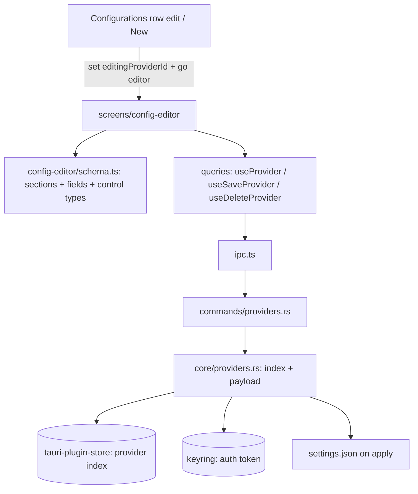

# Design Document — config-editor (S5)

## Overview

S5 has two halves. **Backend:** a store‑backed provider index (`core/providers.rs`) that persists each provider's non‑secret metadata + a full settings payload via `tauri-plugin-store`, keeps the auth token in the keyring vault, and exposes CRUD + apply commands — fixing the S4 persistence gap. **Frontend:** the **Config Editor** screen (`src/screens/config-editor/`) driven by a declarative field schema covering the design's five sections, with section nav, search, the five control types, and validated Save / Delete. Secrets never leave Rust; the editor shows the token only as "set / not set".

## Steering Document Alignment

### Technical Standards (tech.md)
- Reuses S3 `atomic_fs`/`settings`/`keyring_store`; provider metadata + payload in `tauri-plugin-store` (`clavis.store.json`), secret in keyring (`app.clavis.accounts` sibling namespace `app.clavis.providers`). All token I/O in Rust; DTOs carry no token value. Frontend uses TanStack Query + a schema‑driven form.

### Project Structure (structure.md)
- `src-tauri/src/core/providers.rs` (new) + `commands/providers.rs` (extend) + `model.rs` (extend). `src/screens/config-editor/` (screen + FieldRow + section nav), `src/screens/config-editor/schema.ts` (the field schema), `src/lib/queries.ts` (provider hooks).

## Code Reuse Analysis

### Existing Components to Leverage
- **S3** `atomic_fs::write_json_preserving`, `settings::merge_env`, `keyring_store` — persistence + apply. **S3** `model.rs` ProviderMeta extended to a full `ProviderConfig`.
- **S4** `queries.ts` provider hooks (extended), the Configurations rows' edit/new entry points, `go('editor')` routing, `ScreenHeader` back link.
- **S1** `@/ui` Input (text/secret), Select, Button, IconButton, Card, Toast — the editor controls.

### Integration Points
- **tauri-plugin-store** (provider index) + **keyring** (token) ↔ S3 ↔ settings.json. **Configurations** screen ↔ editor via `editingProviderId` in the store + `go('editor')`.

## Architecture

### Modular Design Principles
- **Data‑driven form:** `schema.ts` lists sections + fields (key, label, description, control type, options, default, placeholder, `secret?`); the screen renders rows generically — adding a field is a data edit.
- **Secret isolation:** the token control submits a new value or leaves the vault untouched; "set/not set" comes from a boolean in `get_provider`.
- **Service separation:** `core/providers.rs` owns the index; commands adapt; the screen never calls `invoke`.

## Components and Interfaces

### core/providers.rs (new)
- **Purpose:** persist + read providers.
- **Interface (Rust):** `list() -> Vec<ProviderMeta>`; `get(id) -> ProviderConfigView` (payload minus secret value + `hasToken: bool`); `upsert(ProviderConfigInput, new_token: Option<String>)`; `delete(id)`; `apply(id)` (merge full payload incl. vaulted token into settings.json via `settings`/`atomic_fs`). Index stored as JSON in `tauri-plugin-store`; token in keyring `app.clavis.providers/<id>`.

### model.rs (extend)
- `ProviderConfig { id, title, brand, env: ProviderEnv, config: ProviderSettings }` where `ProviderEnv { baseUrl, model, defaultSonnet, defaultHaiku, maxThinkingTokens?, maxOutputTokens?, httpsProxy?, disableTelemetry? }` (NO token field) and `ProviderSettings { cleanupPeriodDays?, includeCoAuthoredBy?, outputStyle?, forceLoginMethod?, forceLoginOrgUuid?, enableAllProjectMcpServers?, enabledMcpServers? }`. `ProviderConfigView` adds `hasToken: bool`. Input mirror for upsert. None carry a token value.

### commands/providers.rs (extend)
- `list_providers` (now from the index), `get_provider(id)`, `save_provider(input, token?)`, `delete_provider(id)`, `apply_provider(id)` (id‑based now), `clear_provider`. All `Result<_, CoreError>`, no token return.

### src/screens/config-editor/schema.ts
- The declarative sections/fields per Req 3.2, each: `{ section, key, label, description, control: 'text'|'secret'|'number'|'bool'|'enum', options?, default?, placeholder? }`. The single source for the editor's fields.

### src/screens/config-editor/index.tsx (+ FieldRow, SectionNav)
- Back link + title + Delete + Save; left section nav (All + 5) with active highlight; search input filtering by label/description; field area rendering `FieldRow` per schema entry (filtered by section + query). Controlled form state seeded from `useProvider(editingProviderId)`; secret shows "set/not set" + optional new value. Save → validate → `useSaveProvider`; Delete → confirm → `useDeleteProvider` → `go('configs')`.

### queries.ts (extend) + store
- `useProvider(id)`, `useSaveProvider()`, `useDeleteProvider()` (invalidate `providers` + `provider:<id>`). Store gains `editingProviderId` + setter (set by Configurations edit/new; read by the editor).

## Data Models
(See model.rs above.) Persisted: provider index (metadata + payload, no secret) in the store; token in keyring. View model to UI: `ProviderConfigView` (+ `hasToken`), never a token value. Apply composes `env = {ANTHROPIC_BASE_URL, ANTHROPIC_AUTH_TOKEN(from vault), ANTHROPIC_MODEL, ...}` + the config keys, merged into settings.json.

## Error Handling

### Error Scenarios
1. **Invalid form (bad URL / non‑numeric / bad UUID):** Save blocked, inline field errors, no write.
2. **Save persist fails:** stored provider unchanged; toast the `CoreError`.
3. **Apply fails:** S3 backup/rollback applies; toast error (apply is the Configurations action, reused).
4. **Secret untouched on Save:** the vault token is preserved (no token sent); changing it sends the new one.
5. **Delete of the applied provider:** confirm notes it won't change live settings.json unless the user also clears env; default leaves settings.json alone.
6. **Get provider not found:** editor shows a not‑found state with a back link.

## Testing Strategy

### Backend (Rust, temp fixture + mock vault/store)
- `upsert` then `list`/`get` returns the provider (no token in the view); `get.hasToken` reflects vault state; `delete` removes index + token; `apply` merges the full payload into settings.json preserving other keys; secret round‑trips only through the vault (assert no token in the view JSON).

### Frontend (Vitest + Testing Library, IPC mocked)
- schema renders all five sections' fields with the right controls; section nav + search filter fields; editing updates form state; Save validates (blocks on bad URL/number/UUID) then calls `saveProvider` with the right payload (and only sends a token when entered); Delete confirms then calls `deleteProvider` + navigates; secret control never displays a stored value and shows "set/not set".

### Manual (desktop)
- Create a provider from a preset (S4) → it now persists in `list_providers` after refresh; edit it in the Config Editor, Save, reopen → fields persisted; the token stays "set" without ever displaying; a provider apply/clear round‑trip remains reversible (S3 backup).
