# Design Document — configurations-keyring (S4)

## Overview

S4 turns the shell into a working keyring. It introduces a TanStack Query data layer over the S3 IPC commands, refactors `useShellStore` to hold only ephemeral UI plus a thin cached active‑identity (real data comes from queries), builds the real Configurations screen (accounts + providers sections), the capture/add‑account modal, the new‑provider preset menu, the sign‑out confirm, and the env‑override banner, and rewires the sidebar switcher to perform real switches. All secret movement stays in Rust (S3); the webview shows labels/metadata only. A demo fallback keeps the dev gallery working without Tauri.

## Steering Document Alignment

### Technical Standards (tech.md)
- Adds `@tanstack/react-query` (data state) with a `QueryClient` provider; mutations call S3 commands via `src/lib/ipc.ts`, then invalidate narrowly. Zustand keeps only UI state. No secret in React state beyond a single form submit.

### Project Structure (structure.md)
- `src/lib/queries.ts` (query/mutation hooks), refactor `src/lib/store.ts`, real screen at `src/screens/configurations/`, modal/menu components under `src/screens/configurations/` or `src/app/` as appropriate. IPC stays the only backend boundary.

## Code Reuse Analysis

### Existing Components to Leverage
- **S3 `src/lib/ipc.ts`** (the 10 commands) + **`src/lib/types.ts`** DTOs — the data source.
- **S2 `useShellStore`, `Sidebar`, `AccountSwitcher`, `StatusBar`** — rewired to real data; **S2 `registry`** swaps the Configurations placeholder for the real screen.
- **S1 `@/ui/*`** (Card, Badge/ProviderChip, Button, IconButton, Radio, Input, Modal, Toast, Popover) + `AccountAvatar` (S2) — the building blocks.

### Integration Points
- **TanStack Query** ↔ **IPC** ↔ **S3 Rust core** ↔ real `~/.claude` files + keyring. **Toast** for results/errors. **Store** for active‑screen + switcher open state.

## Architecture

```mermaid
graph TD
    Cfg[screens/configurations] --> Q[lib/queries: useAccounts/useProviders/useActiveIdentity + mutations]
    SW[app/AccountSwitcher] --> Q
    Q --> IPC[lib/ipc.ts]
    IPC --> CORE[(S3 Rust commands)]
    Cfg --> Store[lib/store: UI state + active-identity cache]
    SW --> Store
    Q -. invalidate on mutate .-> Q
    Q -. demo fallback when not Tauri .-> Demo[(labelled demo seed)]
```

### Modular Design Principles
- **Service Layer Separation**: all backend access via `queries.ts` (which wraps `ipc.ts`); components never call `invoke` directly.
- **Single File Responsibility**: the Configurations screen composes small subcomponents (AccountRow, ProviderRow, NewProviderMenu, AddAccountModal, EnvOverrideBanner).
- **Secrets isolation**: key‑entry forms submit straight to a mutation and clear; no secret persists in component state/query cache.

## Components and Interfaces

### lib/queries.ts
- **Purpose:** typed query/mutation hooks over IPC.
- **Interfaces:** `useAccounts()`, `useProviders()`, `useActiveIdentity()`, `useEnvOverrides()`, `useSettingsSummary()`; mutations `useSwitchAccount()`, `useApplyProvider()`, `useClearProvider()`, `useAddCurrentAccount()`, `useRemoveAccount()`, `useCreateProvider()`. Each invalidates the relevant queries on success and returns the `CoreError` message on failure.
- **Reuses:** `ipc.ts`. Wrapped so a non‑Tauri environment yields the demo seed (no throw).

### store.ts (refactor)
- Keep `activeScreen`, `paletteOpen`, `switcherOpen` + setters; replace the seeded accounts/providers/counts with a thin `activeIdentity` cache hydrated from `useActiveIdentity` (so Sidebar/StatusBar read instantly) — but the source of truth is the query cache.

### screens/configurations/index.tsx (+ subcomponents)
- **Purpose:** the real keyring screen.
- **Pieces:** `ScreenHeader`; `EnvOverrideBanner` (if override); "Claude accounts" section (`AccountRow[]` + "Add current account"); "API providers" section (`ProviderRow[]` + `NewProviderMenu`); footer note. AccountRow: select→switch, sign‑out→confirm→remove. ProviderRow: select→apply, edit→Config Editor (S5). Empty state when no accounts.

### AddAccountModal
- **Purpose:** capture flow. Reuses `@/ui/Modal`; copy explains capture‑of‑current; "Capture current account" → `useAddCurrentAccount`; on success toast + close; notes how to add a *different* account.

### NewProviderMenu + CreateProviderForm
- **Purpose:** `@/ui/Popover` menu (Blank + 3 presets) → a small form (name, base URL, model, key) → `useCreateProvider` (secret to vault, metadata to store) → switchable. Blank → navigate to Config Editor (S5).

### app/AccountSwitcher (rewire) + StatusBar/Sidebar
- Switcher lists real accounts/providers (from queries), checks the active one, performs real switches; "Sign in with Claude" opens AddAccountModal. StatusBar/Sidebar read the real active identity.

## Data Models
(Defined in S3 `model.rs` / `types.ts` — reused, no new persisted shapes.) S4 adds only view‑models composed from `AccountMeta` + `ActiveIdentity` (e.g. `isActive = activeIdentity.label === account.email`). Secrets are never part of any view‑model.

## Error Handling

### Error Scenarios
1. **Switch fails (rolled back):** mutation returns `CoreError`; toast it; UI stays on the prior active config (no optimistic change).
2. **Env override set:** banner warns; switch still attempted but the apply note explains the override.
3. **Remove active account:** confirm dialog clarifies it only forgets Clavis's copy (live credential untouched).
4. **Not Tauri (gallery/browser):** queries return the demo seed; mutations are disabled/toast "desktop app only".
5. **Create provider without key:** form validation blocks submit.

## Testing Strategy

### Unit/Component Testing (Vitest + Testing Library, IPC mocked)
- `queries.ts`: each hook calls the right `ipc` fn; mutations invalidate the right keys; failure surfaces the error.
- Configurations screen: renders accounts/providers from mocked queries; selecting a row calls the switch mutation; sign‑out asks for confirm then calls remove; empty state shows when no accounts; env banner shows when override present.
- AddAccountModal: capture calls `addCurrentAccount`; dedupe message on existing email.
- store refactor: Sidebar/StatusBar render the real active identity from the cache.

### Integration / Manual (desktop)
- In the real Tauri window: "Add current account" captures THIS machine's logged‑in account into the keyring and it appears in the list with the correct email + tier. A **provider** apply/clear round‑trip is demonstrated safely (adds then clears an `env` block, fully reversible) without needing a second subscription. Switching between two *accounts* is exercised by the user (who has the two real accounts); the engine + UI are proven, and the destructive path is backed by S3's rollback tests.
