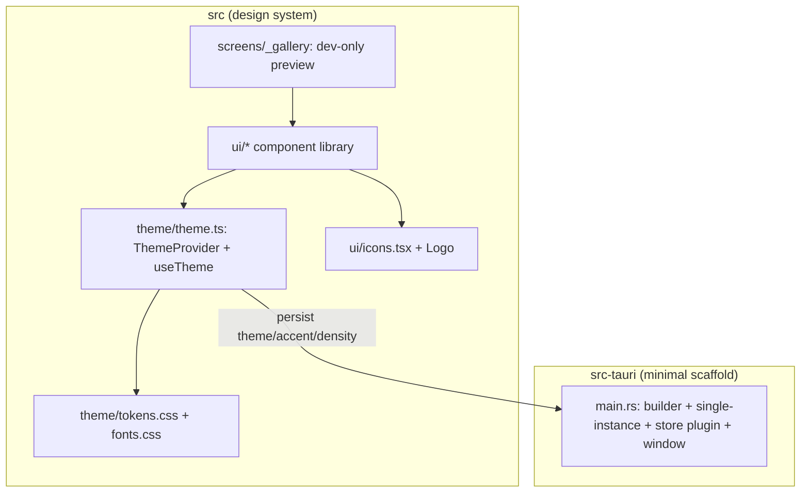

# Design Document — design-system-foundation (S1)

## Overview

S1 stands up the Clavis application skeleton and its design system. It produces: a runnable Tauri v2 + React 19 + TS + Vite 7 project; a single‑source token layer (`src/theme/tokens.css`) with light/dark + accent + density; self‑hosted Geist/Geist Mono; a `ThemeProvider` engine persisted via `tauri-plugin-store`; the icon + C‑Key logo layer; the Clavis component library under `src/ui/`; and a dev‑only gallery route to verify fidelity. No Claude Code files are touched. The authoritative per‑component prop/variant/className spec is `.spec-workflow/research/design-components.md`, cross‑checked against `.design-bundles/components/core/*` and `.design-bundles/tokens/*`; this document defines the architecture that hosts them.

## Steering Document Alignment

### Technical Standards (tech.md)
- Versions pinned per tech.md: Tauri 2.10, React 19, Vite 7, Tailwind v4, TanStack Query v5 (installed, used from S3+), Zustand v5, lucide-react, i18next (scaffolded), `tauri-plugin-store` 2.4.3, `tauri-plugin-single-instance` 2.4.2 (registered first).
- Components reference CSS‑var tokens only (no hardcoded hex); secrets/FS untouched here; capabilities stay narrow.

### Project Structure (structure.md)
- Directories exactly as in structure.md: `src/{app,screens,ui,theme,lib,i18n,assets}`, `src-tauri/{src/{commands,core},capabilities,icons}`. `@/*` alias → `src/`. PascalCase components, kebab‑case folders.

## Code Reuse Analysis

This is the first spec — no prior app code exists. It "reuses" the **design assets** as source of truth:

### Existing Components to Leverage
- **`.design-bundles/tokens/*.css`**: the exact token values (transcribed/imported into `src/theme/tokens.css`).
- **`.design-bundles/components/core/{Button,Switch,Badge,Card,StatTile}.{jsx,d.ts,prompt.md}`**: reference implementations + prop contracts to reimplement faithfully (not copied verbatim; reauthored in our conventions, no fingerprints).
- **`.design-bundles/assets/logo-mark.svg` / `logo-tile.svg`**: the C‑Key logo, turned into React components.
- **`.spec-workflow/research/design-components.md`**: the digested per‑component implementation spec (prop tables, variants, classNames, accent/density mechanics) — the primary build reference.

### Integration Points
- **`tauri-plugin-store`**: persist `{ theme, accent, density }`.
- **Tailwind v4 `@theme`**: maps token CSS vars to Tailwind utility scales so utilities and tokens stay in sync.

## Architecture

Two layers, but S1 is almost entirely frontend; the Rust side is a minimal scaffold (window + store plugin + single‑instance) that grows in S3.



### Modular Design Principles
- **Single File Responsibility**: one component per file in `src/ui/`; tokens only in `theme/tokens.css`; theme logic only in `theme/theme.ts`.
- **Component Isolation**: small focused components; overlays (Popover/Modal/Tooltip/Toast) are independent primitives.
- **Service Layer Separation**: theme persistence goes through a tiny `lib/prefs.ts` wrapper over the store plugin, not scattered.
- **Utility Modularity**: a `cn()` class‑merge helper and a `colorMix` token helper live in `lib/`.

## Components and Interfaces

### Build & scaffold
- **Purpose:** runnable Tauri+React+Vite+Tailwind project with the de‑fingerprinted identity.
- **Interfaces:** `pnpm tauri dev`, `pnpm tauri build`, `pnpm test`.
- **Dependencies:** Node/pnpm, Rust, Tauri CLI (dev dep), system webkit (present).
- **Key files:** `package.json`, `vite.config.ts` (react + tailwind v4 plugin + `@/` alias), `tsconfig.json` (strict, paths), `src-tauri/Cargo.toml`, `src-tauri/tauri.conf.json` (`identifier: "app.clavis"`, productName `Clavis`, window 1300×840 default, store + single-instance), `src-tauri/capabilities/default.json` (core + store), `src-tauri/src/main.rs`.

### Token layer (`theme/tokens.css`, `theme/fonts.css`)
- **Purpose:** all design tokens as CSS vars (light `:root`, dark `.dark`/`[data-theme=dark]`), accent‑derived vars via `color-mix`, density vars; `@font-face` for Geist/Geist Mono.
- **Interfaces:** CSS custom properties consumed by every component + Tailwind `@theme`.
- **Reuses:** `.design-bundles/tokens/*`, design-inventory §17.

### Theme engine (`theme/theme.ts`)
- **Purpose:** apply + persist theme/accent/density.
- **Interfaces:** `<ThemeProvider>`, `useTheme(): { theme, accent, density, setTheme, setAccent, setDensity }`. Applies by setting root `data-theme`, `--accent` (from the 5 presets), and density vars; persists via `lib/prefs.ts`.
- **Dependencies:** `tauri-plugin-store` (through `lib/prefs.ts`).

### Icons & logo (`ui/icons.tsx`)
- **Purpose:** Lucide re‑exports (named set used across screens) + `LogoMark` / `LogoTile`.
- **Interfaces:** `<Icon name=… />` or direct named exports; `<LogoMark size/>`, `<LogoTile size/>`. Active state recolors stroke to `--accent`.

### Component library (`src/ui/*`)
Each component: typed props, token‑only styling, full state matrix (hover/active/press/focus/disabled), keyboard‑accessible.
- **Core (design):** `Button`, `Switch`, `Badge` (incl. provider chip + model/source badge), `Card` (incl. accent left‑bar + hero), `StatTile`.
- **Primitives:** `Input` (text + secret/masked), `Select`, `SegmentedControl`, `IconButton`, `Radio`.
- **Overlays:** `Tooltip`, `Popover`, `Modal` (backdrop + card), `Toast` (minimal provider + `useToast`).
- **Reuses:** `design-components.md` prop tables; `.design-bundles/components/core/*`.

### Gallery (`screens/_gallery`)
- **Purpose:** dev‑only route rendering every component × variant × light/dark for visual verification. Reachable via a dev flag/hash route, not the user nav.

## Data Models

### ThemePrefs (persisted)
```
ThemePrefs:
  theme:   "light" | "dark"            (default "light")
  accent:  "clay" | "blue" | "green" | "violet" | "ember"   (default "clay")
  density: "comfortable" | "compact"   (default "comfortable")
```
Stored under key `theme` in `tauri-plugin-store` (`clavis.store.json` in the app‑config dir). Corrupt/missing → defaults.

### AccentPreset (constant)
```
ACCENTS: { clay:"#d97757", blue:"#4b6bfb", green:"#2f8f63", violet:"#7c6cf0", ember:"#c2410c" }
```

## Error Handling

### Error Scenarios
1. **Stored prefs missing/corrupt:** read fails or value invalid → use defaults, log a dev warning, continue (never crash).
2. **Store plugin unavailable (e.g. web preview):** `lib/prefs.ts` falls back to in‑memory + `localStorage` so the gallery works in a plain browser.
3. **Font fails to load:** `font-display:swap` falls back to `system-ui` / `ui-monospace`; layout unaffected.
4. **Tailwind/token mismatch:** components must compile against defined vars; a missing var renders transparent — caught in the gallery review.

## Testing Strategy

### Unit Testing (Vitest + Testing Library)
- Theme engine: setting theme/accent/density updates the root attributes/vars and persists/restores correctly (mock prefs).
- A representative component sample (Button, Switch, SegmentedControl): renders variants, toggles state, fires handlers, is keyboard‑operable.
- `cn()` and token helpers.

### Integration Testing
- App boots with `ThemeProvider`; switching accent recolors a token‑driven element; switching density changes a card's computed padding.

### End-to-End / Visual
- The gallery renders with zero TS/console errors; manual visual cross‑check vs `.design-bundles` for tokens, fonts, the 5 accents, and light/dark. (Automated screenshot parity is introduced in later, screen‑bearing specs via the design‑handoff‑parity check.)
