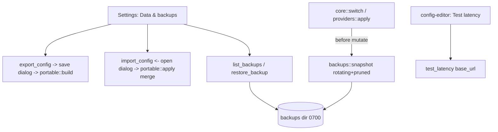

# Design Document — import-export-backups-latency (S15)

## Overview

Three small, self‑contained backends + their Settings/editor surfaces. `core/portable.rs` builds a **secret‑free** export model (providers without keys + prefs + account labels) and applies an import (merge, keyless providers). `core/backups.rs` snapshots the Claude files into a rotating, pruned backups store (snapshot is called by `core::switch` before each mutation) and lists/restores them. `core/latency.rs` times a lightweight request to a provider base URL (no key). The Tauri dialog plugin provides open/save paths; the UI lives in a Settings "Data & backups" card + a per‑provider latency action in the config editor.

## Steering Document Alignment

### Technical Standards (tech.md)
- Reuses S3 `atomic_fs` (atomic copies, 0600/0700), `core::providers`/`prefs` models, the existing HTTP client (S7 usage/`reqwest`) for latency. Adds `tauri-plugin-dialog` (open/save) with a narrow capability. TanStack Query hooks. The keyring is never read by export/latency.

### Project Structure (structure.md)
- `src-tauri/src/core/{portable,backups,latency}.rs` + `commands/{portable,backups,latency}.rs` + `model.rs` DTOs. Frontend: a "Data & backups" card in `src/screens/settings/`, a latency action in `src/screens/config-editor/`, hooks in `queries.ts`.

## Code Reuse Analysis

### Existing Components to Leverage
- **S3** `atomic_fs` (atomic write/copy + perms), `core::switch`/`providers` (snapshot hook + provider list), `claude_json` (paths). **S5** providers index + prefs. **S7** the HTTP client for latency. **S1** `@/ui` Card/Button/Modal/Badge.

### Integration Points
- `core::switch::switch_account` + `core::providers::apply` call `backups::snapshot` before mutating. Export/import ↔ providers index + prefs. Latency ↔ provider baseUrl. Dialog plugin ↔ export/import file paths.

## Architecture

### Modular Design Principles
- Each feature is one core module + thin commands. Export is pure + secret‑free (unit‑tested). Backups snapshot is one call inserted at the two mutation sites. Latency is a bounded timed request. No secret crosses any of these.

## Components and Interfaces

### core/portable.rs
- `ExportDoc { app: "clavis", schema: u32, exported_at, providers: [(label,baseUrl,model)], prefs, accounts: [(label, meta)] }` — NO keys/tokens. `build_export(...)` assembles it; `apply_import(doc) -> ImportSummary { providers_added, providers_updated, prefs_applied }` validates the header then merges (providers keyless; prefs applied; never writes secrets/unknown keys). Foreign/invalid → `CoreError`.

### core/backups.rs
- `snapshot(claude_paths) -> ()` copies each existing file to `<clavis>/backups/<name>.<ts>.bak` (atomic, 0600), then `prune(name, keep=20)`. `list() -> [BackupEntry { id, original, timestamp, size }]` newest‑first. `restore(id)` snapshots current state first, then atomically copies the backup back to its original path (perms preserved). Missing dir → empty list.

### core/latency.rs
- `measure(base_url, samples=3, timeout=3s) -> LatencyResult { ms: Option<u64>, ok: bool, status: Option<u16> }` — one warm‑up then the median of `samples` timed GET/HEADs (no auth header); a reachable non‑2xx still yields `ms`; timeout/error → `ok:false`.

### commands
- `export_config(path)`, `import_config(path) -> ImportSummary`, `list_backups()`, `restore_backup(id)`, `test_latency(base_url) -> LatencyResult` → `Result<_, CoreError>`; registered. The frontend gets `path` from the dialog plugin.

### Frontend
- Settings "Data & backups" `Card`: **Export** (save dialog → `export_config`, toast summary), **Import** (open dialog → `import_config`, toast summary, invalidate providers/prefs), **Backups** (a list from `useBackups()` with timestamp/size + a confirm‑guarded **Restore** → `restore_backup`, invalidate). Config‑editor: a **Test latency** `Button` per provider → `useTestLatency()` showing ms / timeout `Badge`. The "no secrets are exported" note is shown by Export.

## Data Models
- `ExportDoc` / `ImportSummary` / `BackupEntry` / `LatencyResult` (above) — all secret‑free.

## Error Handling
1. **Import foreign/invalid:** reject pre‑apply, clear toast, no partial state.
2. **Restore failure:** the pre‑restore snapshot means the prior state is recoverable; toast the error.
3. **Latency timeout/unreachable:** `ok:false` + a "timeout"/"unreachable" badge, never blocks.
4. **Dialog cancelled:** no‑op.
5. **Off‑Tauri:** export/import/backups demo‑noop with a toast; latency returns a demo value.

## Testing Strategy

### Backend (Rust, temp fixture)
- `portable`: `build_export` contains the providers/prefs/labels and **NO key/token** (assert the serialized string has no secret); `apply_import` merges providers keyless + applies prefs + rejects a foreign header. `backups`: `snapshot` writes a timestamped copy + `prune` keeps N newest; `restore` copies back + snapshots current first; empty dir → empty list. `latency`: a reachable local URL yields `ms`+`ok`; an unroutable URL → `ok:false` within the timeout (use a short timeout in the test).

### Frontend (Vitest, IPC mocked)
- Export/Import call the commands with the dialog path + toast the summary; Backups lists + Restore calls `restore_backup`; Test latency shows ms / timeout.

### Manual (desktop)
- Export writes a JSON with no keys; Import on a fresh profile recreates the providers (keyless) + prefs; a switch creates a backup that Restore brings back; Test latency shows real ms per provider.
