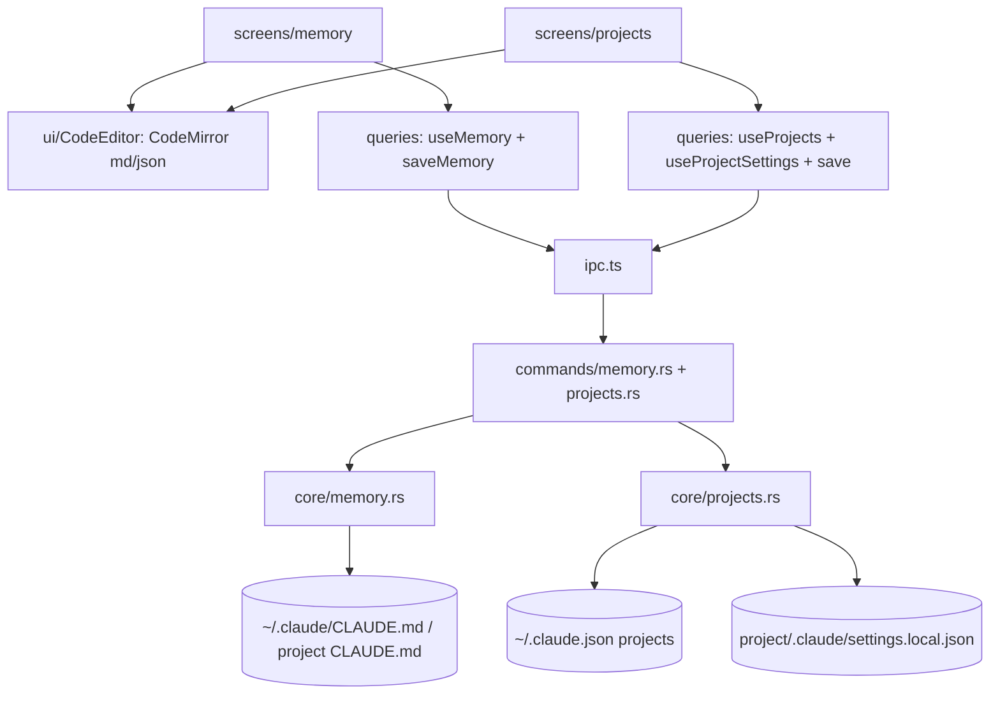

# Design Document — memory-and-projects (S10)

## Overview

Two screens over a small Rust backend. **Memory:** read/write `~/.claude/CLAUDE.md` (and a selected project's `CLAUDE.md`) via `core/memory.rs`, edited in a full‑height inline CodeMirror (markdown) with Save + ⌘S. **Projects:** `core/projects.rs` lists projects from `~/.claude.json` `projects` and reads/writes each project's `.claude/settings.local.json` (JSON, validated, atomic). A reusable inline `CodeEditor` (CodeMirror, language = markdown | json) backs both; the S9 modal `MarkdownEditor` is refactored to wrap it.

## Steering Document Alignment

### Technical Standards (tech.md)
- CodeMirror 6 (already added) + `@codemirror/lang-json` (add). Reuses S3 `atomic_fs`/`paths`/`claude_json`. TanStack Query hooks. No credential access.

### Project Structure (structure.md)
- `src-tauri/src/core/memory.rs` + `core/projects.rs` + `commands/{memory,projects}.rs` + `model.rs`. Frontend: `src/ui/CodeEditor.tsx` (inline), `src/screens/memory/`, `src/screens/projects/`, hooks in `queries.ts`. `MarkdownEditor` (S9) refactors to wrap `CodeEditor`.

## Code Reuse Analysis

### Existing Components to Leverage
- **S3** `paths::{claude_md}`, `atomic_fs::atomic_write` + `read_json_value`, `claude_json` (read `~/.claude.json` `projects`). **S9** CodeMirror deps + `MarkdownEditor` (refactor). **S1** `@/ui` Button, Card, IconButton; the master‑detail pattern echoes `_collection/DetailView`.

### Integration Points
- `~/.claude/CLAUDE.md` + project `CLAUDE.md` ↔ `core/memory` ↔ Memory screen. `~/.claude.json` `projects` + per‑project `.claude/settings.local.json` ↔ `core/projects` ↔ Projects screen. Shared `CodeEditor`.

## Architecture

### Modular Design Principles
- `CodeEditor` is the one inline editor (language‑param); Memory + Projects + (refactored) MarkdownEditor all use it. `core/memory` + `core/projects` are tiny, focused, atomic‑write services.

## Components and Interfaces

### core/memory.rs
- `read_memory(scope) -> MemoryDoc` where scope = Global | Project(path); resolves the path (`~/.claude/CLAUDE.md` or `<project>/CLAUDE.md`), returns `{ path, content }` (empty if absent). `write_memory(scope, content)` atomic write (create if absent).

### core/projects.rs
- `list_projects() -> Vec<Project>` from `~/.claude.json` `projects` keys: `{ path, name, has_local_settings, last_activity? }`. `read_project_settings(path) -> ProjectSettings { path, raw }` (`.claude/settings.local.json`, empty `{}` if absent). `write_project_settings(path, raw)` validate JSON → atomic write (create `.claude/`).

### model.rs (extend)
- `MemoryDoc { path, content }`, `Project { path, name, has_local_settings, last_activity? }`, `ProjectSettings { path, raw }`. Strings only.

### commands
- `read_memory(scope)`, `write_memory(scope, content)`, `list_projects`, `read_project_settings(path)`, `write_project_settings(path, raw)` → `Result<_, CoreError>`; registered in `lib.rs`.

### src/ui/CodeEditor.tsx
- Inline CodeMirror: props `language` ("markdown"|"json"), `value`, `onChange`, `onSave` (⌘S), Clavis token theme (light/dark), full‑height mono. `MarkdownEditor` (S9 modal) refactors to host a `CodeEditor` language="markdown".

### screens/memory/index.tsx
- Header (title "Memory" + mono path subtitle) + a scope selector (Global / a project) + the inline markdown `CodeEditor` seeded from `useMemory(scope)`; Save button + ⌘S → `useSaveMemory`; unsaved‑changes guard on scope switch; "Auto‑saves on ⌘S" hint.

### screens/projects/index.tsx
- Master‑detail: left list from `useProjects()` (name + mono path); right pane = file header `.claude/settings.local.json` + Save + a JSON `CodeEditor` seeded from `useProjectSettings(path)`; validate before Save → `useSaveProjectSettings`; a "Edit CLAUDE.md" link that opens that project in the Memory screen. Empty state when no projects.

### queries.ts
- `useMemory(scope)/useSaveMemory`, `useProjects()/useProjectSettings(path)/useSaveProjectSettings`. Off‑Tauri demo content.

## Data Models
(See above.) Memory scope = global or a project path → a `CLAUDE.md`. Projects come from `~/.claude.json` `projects`; per‑project settings live in `<project>/.claude/settings.local.json` (raw JSON text round‑tripped).

## Error Handling
1. **Missing CLAUDE.md / settings:** open empty (`""` / `{}`), create on Save.
2. **Invalid JSON on project Save:** block + inline error, no write.
3. **Write fails:** atomic → no partial file; toast `CoreError`.
4. **Unsaved changes on scope/project switch:** warn before discarding.
5. **Malformed `~/.claude.json` projects:** empty list.
6. **Off‑Tauri:** demo content.

## Testing Strategy

### Backend (Rust, temp fixture)
- `read_memory(Global)` returns content / empty; `write_memory` creates + round‑trips atomically. `list_projects` reads `~/.claude.json` `projects` keys → names + has_local_settings; `read_project_settings` returns raw / `{}`; `write_project_settings` validates (rejects bad JSON) + atomic write creating `.claude/`; malformed projects → empty.

### Frontend (Vitest + Testing Library, IPC + CodeMirror mocked)
- Memory: renders the path + editor from `useMemory`; Save calls `saveMemory`; scope switch with unsaved changes warns. Projects: lists projects; selecting one loads its settings; invalid JSON blocks Save; valid Save calls `saveProjectSettings`. `CodeEditor` renders value + ⌘S calls onSave.

### Manual (desktop)
- Memory shows this machine's **real** `~/.claude/CLAUDE.md`; an edit + ⌘S round‑trips. Projects lists the real folders from `~/.claude.json`; selecting one shows its `.claude/settings.local.json` (or empty) and Save round‑trips.
