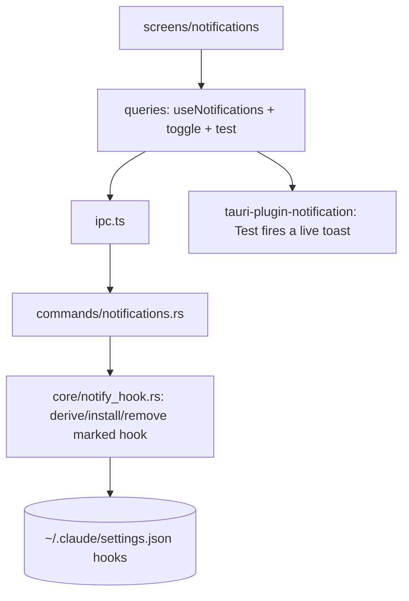

# Design Document — notifications-hook (S12)

## Overview

`core/notify_hook.rs` installs/removes a Clavis‑marked `command` hook in `~/.claude/settings.json` `hooks` for the Stop / Notification / PreToolUse events (mapped to Completion / General / Tool‑use), surgically — adding/removing only the marked array element and preserving every other hook. The current state is derived by scanning for the marker. The **Notifications** screen shows the three toggle rows + Test buttons; Test fires a live notification through the Tauri notification plugin. De‑fingerprinted: a `clavis-notify` marker, per‑OS notification command, no server, no fixed port.

## Steering Document Alignment

### Technical Standards (tech.md)
- Adds `tauri-plugin-notification` + its capability (Test action). Reuses S3 `atomic_fs`/`claude_json` for the surgical `settings.json` `hooks` edit (preserve unknown keys + the user's hooks). TanStack Query hooks.

### Project Structure (structure.md)
- `src-tauri/src/core/notify_hook.rs` + `commands/notifications.rs` + `model.rs`. Frontend `src/screens/notifications/`, hooks in `queries.ts`. `main.rs` registers the notification plugin; capability grants `notification:default`.

## Code Reuse Analysis

### Existing Components to Leverage
- **S3** `claude_json`/`atomic_fs` (read/mutate `~/.claude/settings.json` preserving keys). **S1** `@/ui` Card, Switch, Button. **S4/S7** queries/ipc patterns.

### Integration Points
- `~/.claude/settings.json` `hooks` ↔ `core/notify_hook` ↔ `commands/notifications` ↔ `useNotifications` ↔ the screen. The Tauri notification plugin for Test.

## Architecture

### Modular Design Principles
- One marker constant + one per‑OS command builder. Install = add a marked array element to the event; remove = filter elements whose command contains the marker. The user's elements are untouched.

## Components and Interfaces

### core/notify_hook.rs
- `EVENT_FOR(kind)` → "Stop" | "Notification" | "PreToolUse". `MARKER` = `clavis-notify`. `notify_command(kind)` → per‑OS command string embedding the marker + a human message. `derive_state(settings) -> NotificationState` (scan each event array for a hook command containing the marker). `set_enabled(kind, on)` — read settings → for the event, add the marked element (if absent) or remove marked elements → atomic write preserving everything else.

### model.rs (extend)
- `NotificationState { completion, general, tool_use }` (bools).

### commands/notifications.rs
- `read_notification_state() -> NotificationState`, `set_notification(kind, on)`, `test_notification(kind)` (the last via the notification plugin, frontend may also fire directly) → `Result<_, CoreError>`; registered in `lib.rs`.

### screens/notifications/index.tsx
- A `Card` with three rows (label + description + Test `Button` + `Switch`), bound to `useNotifications()` + `useSetNotification(kind)`; Test → fire a Tauri notification (request permission first); toggle reflects success/failure (toast on error). Off‑Tauri demo state.

### queries.ts
- `useNotifications()` (reads the derived state), `useSetNotification()` (invalidate notifications), `testNotification(kind)` (plugin). Off‑Tauri demo.

## Data Models
(See `NotificationState`.) The installed hook for kind X = an element `{ hooks: [{ type: "command", command: "<notify cmd> # clavis-notify:X" }] }` in `settings.json` `hooks.<Event>`. State derives from the marker's presence.

## Error Handling
1. **Malformed `hooks`:** treat as empty for derivation; install creates the array.
2. **Write fails:** atomic → no partial settings.json; toast `CoreError`; toggle reverts.
3. **Idempotent:** enabling when present = no duplicate; disabling when absent = no‑op.
4. **Notification permission denied (Test):** toast a hint; the hook still installs.
5. **Off‑Tauri:** demo state; Test no‑ops with a toast.

## Testing Strategy

### Backend (Rust, temp fixture)
- A `settings.json` seeded with a USER Stop hook + a USER PreToolUse hook: `set_enabled(Completion, true)` adds the marked Stop element **without touching** the user's Stop element; `derive_state` reports it on; `set_enabled(Completion, false)` removes only the marked element (user's Stop hook intact); enabling twice = single element; all three kinds independent; other settings keys preserved.

### Frontend (Vitest + Testing Library, IPC mocked)
- The three rows render from a mocked state; toggling calls `setNotification(kind, on)`; Test calls the notification path; error toasts on failure.

### Manual (desktop, Linux)
- Toggling Completion on adds a `notify-send`‑based marked hook to `settings.json` (the user's existing hooks remain); Test fires a real desktop notification; toggling off removes only Clavis's entry.
