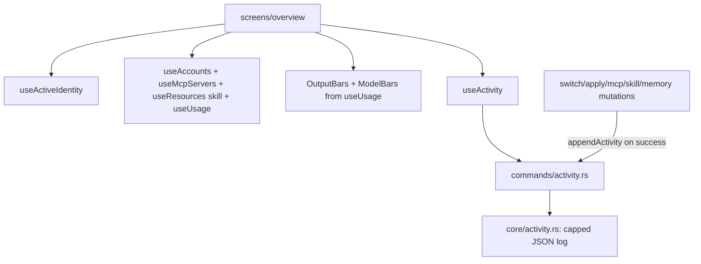

# Design Document — overview-dashboard (S11)

## Overview

The Overview screen composes existing data hooks into the design's landing layout: an active‑connection hero (from `useActiveIdentity`), four deep‑linking stat tiles (accounts/MCP/skills/usage counts), the 30‑day `OutputBars` chart + a new `ModelBars` (tokens by model, from the usage `per_model`), and a recent‑activity feed backed by a tiny new `core/activity.rs` (capped JSON log) that key mutations append to on success. Almost entirely composition; the only new backend is the activity log.

## Steering Document Alignment

### Technical Standards (tech.md)
- Reuses `atomic_fs` for the capped activity log. TanStack Query for `useActivity`; mutation hooks append on success. Reuses S7 `OutputBars`, S1 `StatTile`/`Card`/`Badge`, S2 `AccountAvatar`.

### Project Structure (structure.md)
- `src-tauri/src/core/activity.rs` + `commands/activity.rs` + `model.rs`. Frontend: `src/screens/overview/index.tsx`, `src/ui/charts/ModelBars.tsx`, `useActivity`/`appendActivity` in `queries.ts` (called from the relevant mutation hooks).

## Code Reuse Analysis

### Existing Components to Leverage
- **S4** `useActiveIdentity`, `useAccounts`; **S8** `useMcpServers`; **S9** `useResources('skill')`; **S7** `useUsage` + `OutputBars`. **S1** `StatTile`, `Card`, `Badge`, `ProviderChip`; **S2** `AccountAvatar`, `go()` navigation. **S3** `atomic_fs` for the activity log.

### Integration Points
- The activity log file in the Clavis config dir ↔ `core/activity` ↔ `read_activity`/`append_activity` ↔ `useActivity`/the mutation success handlers. The Overview reads all the existing query hooks.

## Architecture

### Modular Design Principles
- The Overview is presentation/composition; no new data logic beyond the activity log. `ModelBars` is a small reusable chart. The activity append is wired in the existing mutation hooks (one place each).

## Components and Interfaces

### core/activity.rs
- `append(kind, message)` — push `{ kind, message, timestamp_ms }` to a capped (50) JSON array in `<clavis-config>/activity.json`, atomic. `read(limit) -> Vec<ActivityEntry>` newest‑first. Corrupt/missing → empty.

### model.rs (extend)
- `ActivityEntry { kind, message, timestamp }` (kind: e.g. "account"|"provider"|"mcp"|"skill"|"memory"; message: label only; timestamp ms). No secrets.

### commands/activity.rs
- `append_activity(kind, message)`, `read_activity(limit)` → `Result<_, CoreError>`; registered in `lib.rs`.

### queries.ts
- `useActivity(limit)` query; a thin `appendActivity(kind, message)` helper. `useSwitchAccount`/`useApplyProvider`/`useSaveMcpServer`/`useToggleMcpServer`/`useSkillEnabled`/`useSaveMemory` call `appendActivity` in `onSuccess` (and invalidate `activity`). Off‑Tauri demo entries.

### src/ui/charts/ModelBars.tsx
- Horizontal bars from `ModelTotal[]`: each row = model name (mono) + formatted tokens + an accent fill bar (width = pct of max). Token‑only.

### screens/overview/index.tsx
- Sticky header ("Overview" + one‑liner); hero (account/provider variant from `useActiveIdentity`, primary action per variant); 4 `StatTile`s (counts from the hooks, each `onClick={() => go(...)}`); a charts row (Output tokens `OutputBars` + Tokens by model `ModelBars` from `useUsage`); a "Recent activity" `Card` listing `useActivity()` (icon by kind + message + relative time, empty state).

## Data Models
(See `ActivityEntry`.) Counts derive: accounts = `useAccounts().length`; mcp = enabled `useMcpServers`; skills = enabled `useResources('skill')`; tokens today = `useUsage` today's output. Charts from `useUsage` `per_day` + `per_model`.

## Error Handling
1. **Activity log missing/corrupt:** empty feed.
2. **A count query loading/empty:** tile shows 0 / a skeleton.
3. **appendActivity failure:** non‑fatal (the mutation already succeeded); swallow + log.
4. **Off‑Tauri:** demo identity/counts/usage/activity so the gallery renders.

## Testing Strategy

### Backend (Rust, temp fixture)
- `append` caps at 50 + newest‑first `read(limit)`; corrupt/missing file → empty; atomic write.

### Frontend (Vitest + Testing Library, IPC mocked)
- Overview renders the hero from a mocked active identity (account + provider variants); 4 tiles show the mocked counts and navigate on click; charts render from mocked usage; the activity feed lists mocked entries + shows the empty state. A mutation success appends an activity entry (spy on appendActivity).

### Manual (desktop)
- The Overview shows the **real** active account hero, real counts (accounts/MCP/skills/tokens‑today), the real usage charts, and — after performing a switch/toggle — a real recent‑activity entry. This is the headline visual screen; screenshot it.
