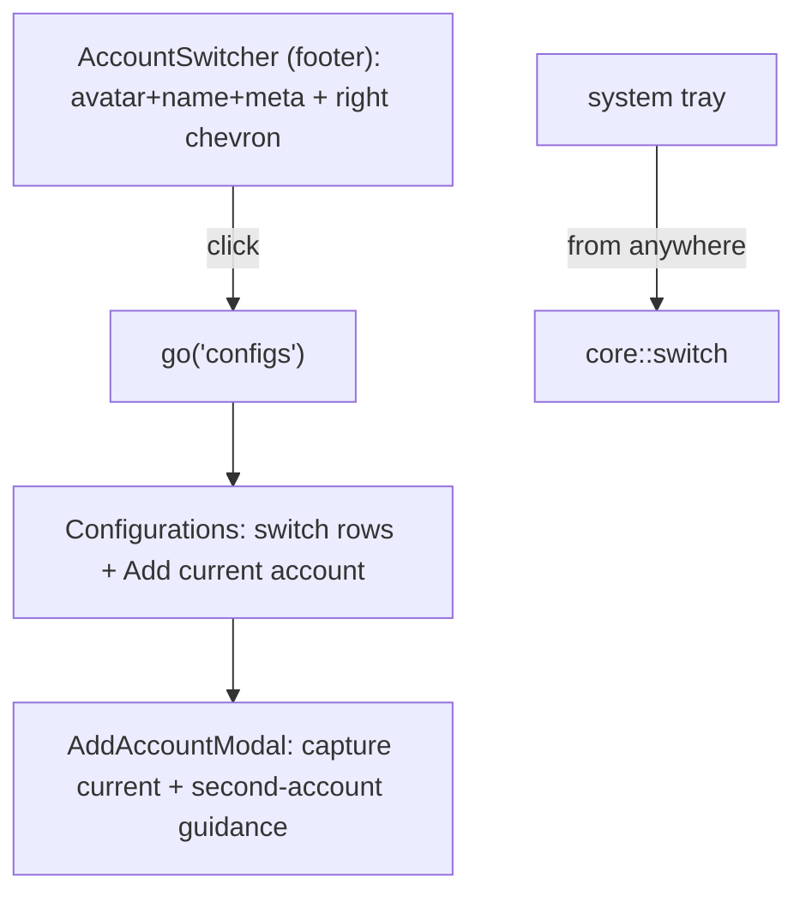

# Design Document — sidebar-footer-display (S18)

## Overview

Refactor the sidebar footer component (`src/app/AccountSwitcher.tsx`) from a
Popover‑based inline switcher into a plain display‑forward button that navigates
to Configurations. Remove the now‑dead popover code + the store's switcher‑open
state. The exports other surfaces use (`AccountAvatar`, `initialsOf`) and the
Configurations `AccountRow` switching are untouched; the single add path remains
the existing `AddAccountModal`. Presentation‑only; no backend change.

## Steering Document Alignment

### Technical Standards (tech.md)
- Reuses the store `go(screen)` action; `@/ui` button styling; tokens only. No new
  deps, no IPC. Keeps the existing safe switch/capture core.

### Project Structure (structure.md)
- Edits: `src/app/AccountSwitcher.tsx` (the footer component), `src/lib/store.ts`
  (drop unused switcher flags), the footer/sidebar tests. The component file +
  exported name (`AccountSwitcher`) are retained to minimize churn; only its doc
  comment + behavior change.

## Code Reuse Analysis

### Existing Components to Leverage
- The current `card` markup (avatar + label + meta) is reused verbatim as the
  button content. The store `go` action (already used by Projects) drives nav.
  `AccountAvatar`/`initialsOf` stay exported. `AddAccountModal` is the single add
  surface (unchanged — already honest about capture + the second‑account flow).

### Integration Points
- Footer button `onClick` → `go("configs")`. Configurations rows + the tray remain
  the switch surfaces.

## Architecture

### Modular Design Principles
- The footer becomes a single‑purpose nav button (no internal switch state). All
  switch/add logic already lives in Configurations / the tray / the modal — this
  spec only deletes the duplicate.

## Components and Interfaces

### AccountSwitcher (footer) — `src/app/AccountSwitcher.tsx`
- Keep the reads of `activeIdentity` (label/sub) + the `card` content (avatar +
  name + meta). Replace the trailing `ChevronsUpDown` with a muted `ChevronRight`
  (navigation affordance). Wrap nothing in `Popover`: the component returns the
  button directly with `onClick={() => go("configs")}`, `aria-label="View accounts
  in Configurations"` (drop `aria-haspopup`/`aria-expanded`).
- Delete: `selectAccount`, `selectProvider`, the popover menu JSX, the
  `useSwitchAccount`/`useApplyProvider`/`useAccounts`/`useProviders` hooks,
  `accountIsActive`/`providerIsActive`/`RowText`/`PanelDivider`/`ProviderChip`/
  `brandForProvider`/`Check`/`Popover`/`ChevronsUpDown`/`Plus` imports and the
  `switcherOpen`/`openSwitcher`/`closeSwitcher`/`openAddAccount` store reads — each
  only if it becomes unused after the popover is gone (verify per‑symbol).
- Update the file doc comment to describe a display + navigate card.

### store — `src/lib/store.ts`
- Remove `switcherOpen` + `openSwitcher`/`closeSwitcher`/`toggleSwitcher` (and the
  state field) iff a repo‑wide search shows no remaining consumer. Leave
  `addAccountOpen`/`openAddAccount`/`closeAddAccount` and `go` intact.

### Tests
- `src/app/Sidebar.test.tsx` (and any AccountSwitcher test): assert that clicking
  the footer card calls `go("configs")` (or sets `activeScreen` to `configs`) and
  that no switch Popover/menu opens; the active label still renders. Keep the
  AccountAvatar/initialsOf usages working.

## Data Models
- None. (Store loses the unused `switcherOpen` boolean.)

## Error Handling
1. **`go` to configs while already on configs:** no‑op navigation (harmless).
2. **Off‑Tauri/demo:** the footer still shows the demo identity and navigates
   (no backend involved).

## Testing Strategy

### Frontend (Vitest)
- Footer click → `go("configs")`; no popover/menu role appears; active identity
  label renders. Existing Configurations switch tests + AddAccountModal tests stay
  green (the modal/add path is unchanged). A repo build confirms no unused‑symbol
  breakage.

### Manual (desktop)
- Click the bottom‑left card → lands on Configurations; there is no inline switch
  popover anymore; switching is done via the Configurations rows (and the tray);
  "Add current account" still opens the honest capture modal.
