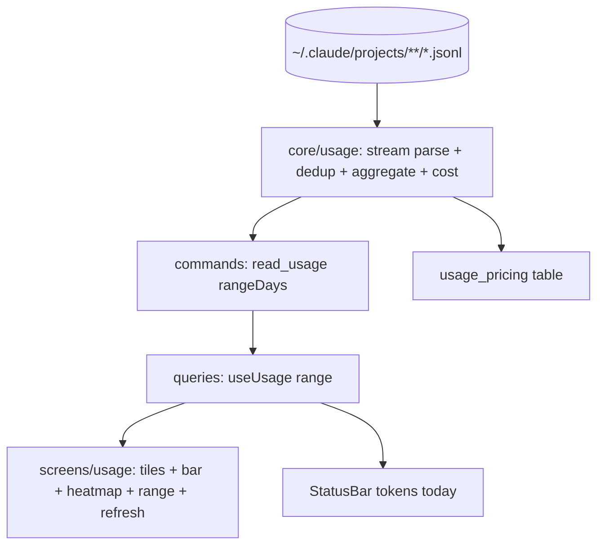

# Design Document — usage-analytics (S7)

## Overview

A Rust streaming parser (`core/usage.rs`) reads `~/.claude/projects/**/*.jsonl` line‑by‑line, dedups by `requestId`+`message.id`, and aggregates into totals, a per‑day series, a per‑model ranking, an estimated cost (from a pricing table), and a past‑year per‑day map for the heatmap. A `read_usage(rangeDays)` command returns these as plain numbers. The **Usage** screen renders four stat tiles, an output‑tokens/day bar chart (Recharts), a custom SVG contribution **Heatmap**, a 30/7 range toggle, and refresh. The status bar's "tokens today" is wired to the aggregate. No credentials are read; only local numbers leave Rust.

## Steering Document Alignment

### Technical Standards (tech.md)
- Recharts for the bar chart; a bespoke SVG `Heatmap` (per tech.md, custom for the contribution grid). TanStack Query `useUsage(range)` with on‑demand refetch. Streaming parse for bounded memory. Pricing table maintained in one Rust module.

### Project Structure (structure.md)
- `src-tauri/src/core/usage.rs` + `commands/usage.rs` (or extend `commands/settings.rs` → a new `commands/usage.rs`); `model.rs` gains `UsageSummary`. Frontend: `src/screens/usage/`, `src/ui/charts/Heatmap.tsx` + `BarChart` wrapper, `useUsage` in `queries.ts`.

## Code Reuse Analysis

### Existing Components to Leverage
- **S3** `core/paths::projects_dir` for the jsonl root; `model.rs`/`CoreError`. **S1** `@/ui` StatTile, Card, SegmentedControl, IconButton; **recharts** (in tech stack). **S4** queries/ipc patterns. The status bar (`selectStatus`) gains a real tokens‑today.

### Integration Points
- jsonl files ↔ `core/usage` ↔ `read_usage` command ↔ `useUsage` ↔ Usage screen + status bar. Accent/theme tokens drive the heatmap colors.

## Architecture

### Modular Design Principles
- Parser is pure + streaming (input: a dir, output: an aggregate struct), unit‑tested over fixtures. Pricing is data. The Heatmap + BarChart are reusable chart components. The screen is presentation only.

## Components and Interfaces

### core/usage.rs
- `aggregate(projects_dir, range_days, today_local) -> UsageSummary` — walk `*.jsonl`, stream lines, keep assistant lines with `message.usage`, dedup `(requestId, messageId)`, bucket by local date, sum token kinds, per‑model totals, build the per‑day series (range) + past‑year heatmap map, compute cost via `price_of(model)`. `pricing()` returns the per‑model rate table.
- Pure helpers take an injected `today` for deterministic tests.

### model.rs (extend)
- `UsageSummary { range_days, totals: TokenTotals, est_cost_usd: f64, unknown_models: [String], per_day: [DayPoint], per_model: [ModelTotal], heatmap: [HeatCell] }` where `TokenTotals { input, output, cache_creation, cache_read }`, `DayPoint { date, output, input, cache_read }`, `ModelTotal { model, tokens }`, `HeatCell { date, tokens, level }` (level 0–4). All numeric/string, no secrets.

### commands/usage.rs
- `read_usage(range_days: u32) -> Result<UsageSummary, CoreError>` (default 30). Registered in `lib.rs`.

### queries.ts + ipc.ts + types.ts
- `readUsage(rangeDays)` ipc wrapper; `useUsage(range)` query (+ a manual `refetch` for refresh); types mirror `UsageSummary`. The status‑bar tokens‑today reads `summary.per_day[today].output` via the queries layer (hydrating the store cache). Off‑Tauri → labelled demo series.

### ui/charts/Heatmap.tsx + BarChart wrapper
- `Heatmap` — 53×7 grid of cells colored by `level` using `color-mix` off `--accent` (5 steps), weekday labels, Less…More legend, tooltip per cell. `OutputBars` — a Recharts bar chart (last bar accent, others accent@62%, tooltip).

### screens/usage/index.tsx
- Header + range SegmentedControl (30/7) + refresh IconButton; four StatTiles (input/output/cache‑read/est‑cost with colored dots); `OutputBars` for the range; `Heatmap` (past year); empty + loading states.

## Data Models
(See `UsageSummary` above.) Pricing table: `model → { input, output, cacheWrite, cacheRead }` USD per‑token (or per‑Mtok) for known Claude models + common third‑party; unknown → 0 and added to `unknown_models`. Cost = Σ tokens×rate.

## Error Handling

### Error Scenarios
1. **Malformed line:** skipped (continue); **unreadable file:** skipped; parse never panics.
2. **No projects dir / empty history:** returns zeroed summary (screen shows zeros + empty heatmap).
3. **Unknown model:** priced 0, listed in `unknown_models` (UI may note "some models unpriced").
4. **Huge history:** streaming keeps memory bounded; refresh re‑reads on demand.
5. **Off‑Tauri:** demo series so the gallery renders.

## Testing Strategy

### Backend (Rust, fixture jsonl in a temp dir)
- A fixture with: two assistant lines same `requestId`+`messageId` (counted once), a cache line, two models across two local dates, and a malformed line (skipped). Assert totals, per‑day, per‑model ranking, dedup, heatmap levels, and cost (known rates) vs unknown‑model = 0 + flagged.

### Frontend (Vitest + Testing Library, IPC mocked)
- Usage screen renders 4 tiles from a mocked summary; range toggle calls `useUsage` with 7 then 30; refresh triggers refetch; heatmap renders 53×7 cells with levels; empty summary → zeros. Status bar shows today's output tokens from the aggregate.

### Manual (desktop)
- On this machine the Usage screen shows **real** token usage parsed from `~/.claude/projects/**` — totals, per‑day bars, and a populated yearly heatmap — proving the parser end‑to‑end.
